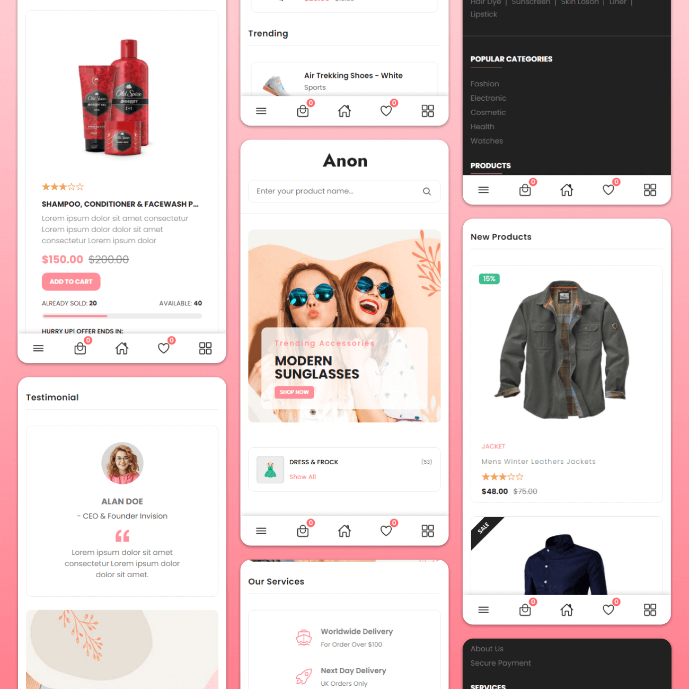

<<<<<<< HEAD
This is a [Next.js](https://nextjs.org) project bootstrapped with [`create-next-app`](https://nextjs.org/docs/app/api-reference/cli/create-next-app).

## Getting Started

First, run the development server:

```bash
npm run dev
# or
yarn dev
# or
pnpm dev
# or
bun dev
```

Open [http://localhost:3000](http://localhost:3000) with your browser to see the result.

You can start editing the page by modifying `app/page.js`. The page auto-updates as you edit the file.

This project uses [`next/font`](https://nextjs.org/docs/app/building-your-application/optimizing/fonts) to automatically optimize and load [Geist](https://vercel.com/font), a new font family for Vercel.

## Learn More

To learn more about Next.js, take a look at the following resources:

- [Next.js Documentation](https://nextjs.org/docs) - learn about Next.js features and API.
- [Learn Next.js](https://nextjs.org/learn) - an interactive Next.js tutorial.

You can check out [the Next.js GitHub repository](https://github.com/vercel/next.js) - your feedback and contributions are welcome!

## Deploy on Vercel

The easiest way to deploy your Next.js app is to use the [Vercel Platform](https://vercel.com/new?utm_medium=default-template&filter=next.js&utm_source=create-next-app&utm_campaign=create-next-app-readme) from the creators of Next.js.

Check out our [Next.js deployment documentation](https://nextjs.org/docs/app/building-your-application/deploying) for more details.
=======
# Anon - An eCommerce Website


[](https://twitter.com/intent/follow?screen_name=codewithsadee_)
[](https://youtu.be/3l8Lob4ysI0)

Anon is a fully responsive ecommerce website, maximum compatiblities in all mobile devices, built using HTML, CSS, and JavaScript.

## Demo




## Prerequisites

Before you begin, ensure you have met the following requirements:

* [Git](https://git-scm.com/downloads "Download Git") must be installed on your operating system.

## Installing Anon

To install **Anon**, follow these steps:

Linux and macOS:

```bash
sudo git clone https://github.com/codewithsadee/anon-ecommerce-website.git
```

Windows:

```bash
git clone https://github.com/codewithsadee/anon-ecommerce-website.git
```

## Contact

If you want to contact me you can reach me at [Twitter](https://www.twitter.com/codewithsadee).

## License

This project is **free to use** and does not contains any license.
>>>>>>> 48a9d8af05333cbe8c7db6d2364f1fb75646ba80
